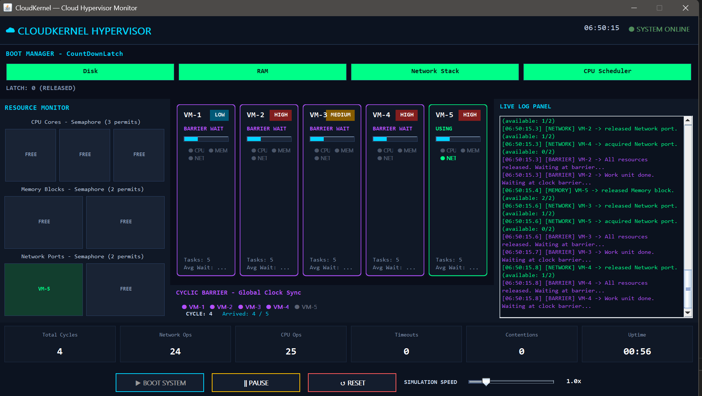

# CloudKernel Architecture

## Purpose

CloudKernel models a cloud-hypervisor execution cycle with Java concurrency primitives while exposing runtime behavior through a real-time Swing dashboard.

## Layers

- Entry: Main.java
- Configuration: config.ConfigLoader
- Concurrency Core: core.BootManager, core.ClockSynchronizer
- Runtime Entities: entities.VirtualMachine, entities.ResourceManager, entities.VMState, entities.VMPriority, entities.VMStats
- Observability: utils.GUILogger, utils.StatsCollector
- UI: ui.CloudKernelGUI and component panels
- Shutdown: shutdown.ShutdownManager

## Concurrency Contracts

### BootManager

- Uses CountDownLatch(4).
- Boots disk, RAM, network stack, and CPU scheduler asynchronously.
- Exposes latch for visual countdown.

### ClockSynchronizer

- Uses CyclicBarrier(vmCount).
- Increments global cycle in barrier action.
- Records cycle completion in StatsCollector.

### ResourceManager

- Uses three fair semaphores:
  - CPU permits
  - Memory permits
  - Network permits
- Uses timeout-based tryAcquire for deadlock-resistant resource requests.
- Tracks current holders for UI rendering.

### VirtualMachine

- Executes configured number of cycles.
- Transitions through VMState values.
- Requests CPU, memory, network resources sequentially.
- Synchronizes on cyclic barrier each cycle.

## UI Composition

CloudKernelGUI builds the dashboard from modular components:

- VMCard
- ResourceMonitorPanel
- BarrierPanel
- LogPanel
- StatsBar
- ControlPanel
- DashboardUpdater

DashboardUpdater centralizes UI refresh operations and dispatches thread-crossing updates via SwingUtilities.invokeLater.

## Data And Events

- GUILogger writes every event to terminal and broadcasts to GUI listeners.
- CloudKernelGUI parses selected log patterns to drive visual state changes.
- StatsCollector aggregates per-VM and system-wide counters for the stats bar and summary output.

## Runtime Flow

1. Main launches CloudKernelGUI on the Swing event dispatch thread.
2. GUI initializes managers and registers listeners.
3. User starts simulation through ControlPanel.
4. BootManager performs subsystem initialization.
5. VirtualMachine threads execute cycles with resource access and barrier sync.
6. DashboardUpdater continuously refreshes resources, VM cards, barrier state, and stats.
7. ShutdownManager prints graceful summary on termination.

