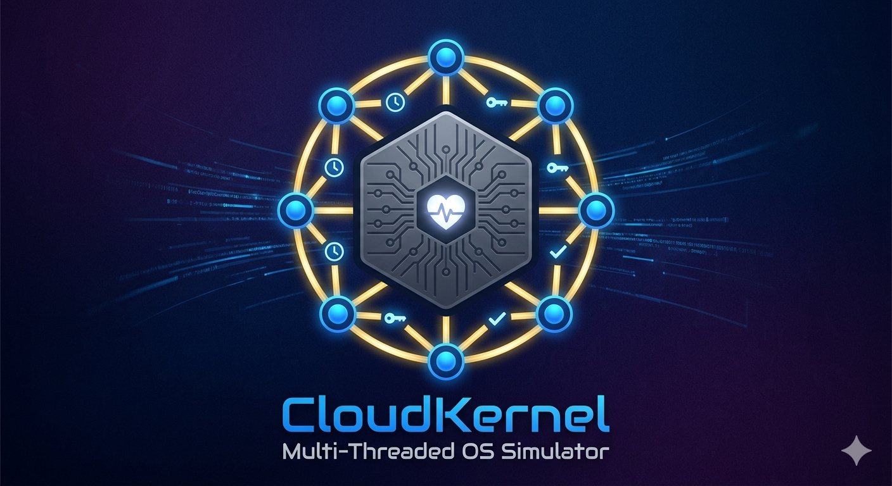

# CloudKernel

CloudKernel is a Java concurrency simulator with a professional Swing dashboard that visualizes hypervisor-like VM scheduling, shared resource contention, and synchronization.

## Highlights

- Dark-theme dashboard: Cloud hypervisor monitor layout.
- Boot orchestration with CountDownLatch.
- VM cycle synchronization with CyclicBarrier.
- Shared CPU, memory, and network resources with fair semaphores and timeout handling.
- Color-coded live logs streamed to terminal and GUI simultaneously.
- Live stats for cycles, operations, contentions, timeouts, and uptime.
- Configurable behavior through config.properties.


## Final Package Structure

```text
CloudKernel/
  src/
    Main.java
    config/
      ConfigLoader.java
    core/
      BootManager.java
      ClockSynchronizer.java
    entities/
      ResourceManager.java
      VirtualMachine.java
      VMPriority.java
      VMState.java
      VMStats.java
    shutdown/
      ShutdownManager.java
    ui/
      BarrierPanel.java
      CloudKernelGUI.java
      ControlPanel.java
      DashboardUpdater.java
      LogPanel.java
      ResourceMonitorPanel.java
      StatsBar.java
      VMCard.java
    utils/
      GUILogger.java
      StatsCollector.java
  config.properties
  ARCHITECTURE.md
  doc/
    PROJECT_PROPOSAL.md
```

## GUI Overview

Main window sections:

- Header: title, digital clock, online indicator.
- Boot panel: resource chips and latch countdown.
- VM dashboard: one card per VM with state, priority, progress, and resource indicators.
- Left sidebar: semaphore slot view for CPU, memory, and network.
- Barrier panel: arrival dots and cycle display.
- Right sidebar: color-coded live event log.
- Bottom bars: statistics and controls.

## Core Concurrency Model

- Boot phase: CountDownLatch initialized to four boot tasks.
- Runtime phase: each VM executes for configured cycles.
- Resource phase: each VM requests CPU, memory, and network permits with timeout.
- Synchronization phase: all VMs rendezvous at a CyclicBarrier before the next cycle.

## Configuration

Edit config.properties before running:

- vm.count
- cycle.count
- semaphore.cpu.permits
- semaphore.memory.permits
- semaphore.network.permits
- task.duration.min
- task.duration.max
- timeout.duration
- gui.enabled
- gui.theme
- gui.font
- logging.level
- stats.enabled

## Build And Run

From CloudKernel root:

```powershell
javac -encoding UTF-8 -d bin (Get-ChildItem -Recurse src -Filter *.java | ForEach-Object { $_.FullName })
java -cp "bin;." Main
```

## Notes

- All UI updates triggered by worker threads are dispatched through SwingUtilities.invokeLater.
- Main.java contains only the GUI entry point.
- Legacy duplicate docs and unused legacy classes were removed to keep one canonical implementation path.
